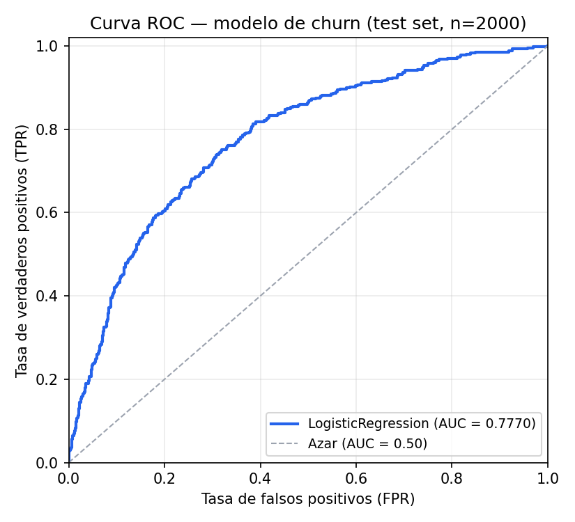

# churn-api — Servicio MLOps end-to-end de predicción de churn

Servicio de **predicción de fuga de clientes (customer churn)** para una entidad bancaria, expuesto como API REST. El modelo es una **regresión logística** entrenada sobre el dataset `Churn_Modelling.csv`, empaquetado con FastAPI, containerizado con Docker y desplegado en **Google Cloud Run** mediante un pipeline de CI/CD automatizado con GitHub Actions.

---
## Servicio en producción (Google Cloud Run)

**URL pública:** https://churn-api-373252903708.southamerica-west1.run.app


Probar sin instalar nada:

```bash
# Estado del servicio (200 OK sobre HTTPS)
curl -s https://churn-api-373252903708.southamerica-west1.run.app/health

# Predicción real
curl -s -X POST https://churn-api-373252903708.southamerica-west1.run.app/predict \
  -H 'Content-Type: application/json' \
  -d '{"CreditScore":650,"Geography":"France","Gender":"Female","Age":40,"Tenure":3,"Balance":75000.0,"NumOfProducts":2,"HasCrCard":1,"IsActiveMember":1,"EstimatedSalary":100000.0}'
```

**Proveedor:** Google Cloud Run · **Plan:** capa gratuita (cuenta de facturación estándar, sin crédito de $300).
**Cold start:** el servicio escala a cero. La **primera** petición tras un rato de inactividad puede tardar **varios segundos** (por el peso de la imagen, puede superar 10–15 s). **No está caído**. Luego, la segunda respuesta ya es inmediata.

## Integrantes del equipo

- Alejandra Véliz
- Valentina Ariztía
- Leonor Saravia
- Jonathan Machuca
- Hemersson Gutiérrez

## Uso de IA en el desarrollo

Como equipo utilizamos **IA (Claude, Anthropic)** durante el desarrollo de este proyecto, principalmente como **potenciador del trabajo del equipo y no como reemplazo del criterio propio**: consultas conceptuales (MLOps, buenas prácticas de CI/CD, estructura del pipeline), apoyo en la redacción y organización de este README, y ayuda puntual en aspectos de programación (por ejemplo, la implementación del `ColumnTransformer`/`Pipeline` de scikit-learn, la configuración del workflow de GitHub Actions y la escritura de tests). Las decisiones de modelado, las desviaciones documentadas respecto al notebook original (sección 4) y la validación de los resultados fueron revisadas y decididas por el equipo.

## 1. El problema: modelo de churn

Este servicio predice, para un cliente bancario dado, la **probabilidad de que abandone el banco (churn)**. La variable objetivo es `Exited` (1 = el cliente se fue, 0 = el cliente se quedó).

### Desbalance de clases

El dataset presenta un **desbalance de clases real**, calculado sobre las 10.000 filas de `Churn_Modelling.csv`:

| Clase | Significado | Cantidad | Porcentaje |
|---|---|---|---|
| 0 | Cliente se queda | 7.963 | **79.63%** |
| 1 | Cliente abandona (churn) | 2.037 | **20.37%** |

Este desbalance (~80/20) es la razón por la que el modelo se entrena con `class_weight="balanced"` y se evalúa con precision, recall, F1 y ROC-AUC — **no sólo con accuracy**, ya que un modelo trivial que siempre prediga "no churn" alcanzaría ~80% de accuracy sin ser útil para el negocio.

## 2. Fuente de datos y de código

La base de datos y el código utilizado como referencia para el modelo corresponden al obtenido de **[Customer Churn Dataset](https://www.kaggle.com/datasets/anandshaw2001/customer-churn-dataset)** (Kaggle), y al notebook público [ih8asham/customer-churn-dataset](https://www.kaggle.com/code/ih8asham/customer-churn-dataset), del cual se replicó fielmente el enfoque de preprocesamiento y feature engineering para la regresión logística (ver sección 4).

> **Privacidad:** este README y el modelo **no incluyen** `CustomerId`, `Surname`, ni ninguna otra clave o identificador personal del cliente. Estas columnas se descartan explícitamente en `training/data.py` (`ID_COLUMNS`) antes de que el modelo las vea.

## 3. Arquitectura y flujo end-to-end

```
Dataset (CSV) → training/ (entrenamiento + gate de calidad) → models/ (artifact versionado)
      → app/ (FastAPI, sirve el modelo) → Docker → Artifact Registry → Cloud Run
      → GitHub Actions orquesta todo el flujo en cada push a main
```

- **Entrenamiento** (`training/`): separado del servicio (`app/`). El modelo se entrena una vez, se serializa (`model.joblib`) y el servicio sólo lo carga y lo usa — nunca reentrena en caliente.
- **Servicio** (`app/`): FastAPI expone `/predict`, valida cada request contra un contrato Pydantic estricto, y nunca responde `500` genérico ante un input inválido (responde `422` con el detalle del campo).
- **Métricas de servicio** (bonus, ver sección 7): latencia, conteo de requests y errores expuestos en `/metrics` en formato Prometheus.
- **CI/CD** (`.github/workflows/ci-cd.yml`): 5 jobs encadenados como gates secuenciales — `lint → test → train-and-gate → docker-build → deploy`. Si cualquiera falla, los siguientes no se ejecutan.
- **Despliegue**: Google Cloud Run, contenedor sin estado (stateless), escala a cero cuando no hay tráfico.

## 4. Modelo: regresión logística

Pipeline fiel al notebook de referencia, implementado en `training/model.py`:

1. **Ingeniería de features**: se deriva `AgeGroup` a partir de `Age` con los mismos bins del notebook (`[18,30,50,100]` → `Young/Adult/Old`), calculado dentro del pipeline (no antes del split) para que se aplique igual en entrenamiento y en cada predicción individual servida por la API.
2. **Preprocesamiento**: `ColumnTransformer` con `OneHotEncoder(drop="first", handle_unknown="ignore")` para `Geography`, `Gender`, `AgeGroup`, y `StandardScaler` para las variables numéricas.
3. **Modelo base**: `LogisticRegression(class_weight="balanced", max_iter=1000, random_state=42)`.

**Features utilizadas:** `CreditScore`, `Geography`, `Gender`, `Age`, `Tenure`, `Balance`, `NumOfProducts`, `HasCrCard`, `IsActiveMember`, `EstimatedSalary` (+ `AgeGroup` derivado).
**Columnas excluidas siempre:** `RowNumber`, `CustomerId`, `Surname` (identificadores, sin valor predictivo y con datos personales).

### Reproducibilidad (semilla fija)

Para que los resultados sean replicables entre corridas, todos los puntos con aleatoriedad usan `random_state = 42` por defecto:

- **Split train/test** (`train_test_split` en `training/data.py::get_dataset`).
- **Modelo** (`LogisticRegression(..., random_state=42)` en `training/model.py::build_model`).

`training/train.py` expone además el flag `--random-state` (default `42`) para dejarlo explícito al entrenar, y el valor efectivo queda registrado en `models/metadata.json` (campo `random_state`) junto con las métricas de cada corrida, de modo que el modelo publicado y sus métricas siempre queden trazados a la semilla con la que se generaron.

### Desviaciones documentadas respecto al notebook original

Se declaran explícitamente por honestidad técnica, no son errores del notebook sino mejoras necesarias para servir el modelo como API:

| Notebook original | Este proyecto | Por qué |
|---|---|---|
| `pd.get_dummies` sobre todo el DataFrame | `ColumnTransformer` + `OneHotEncoder` fitteado en train | `get_dummies` genera columnas distintas según qué categorías aparecen en cada request; se rompe con una sola fila de inferencia (training/serving skew). |
| `train_test_split` sin `stratify` | `stratify=y` | El dataset tiene desbalance de clases; sin estratificar, el split puede generar folds de test con proporción de churn distinta a la real. |
| `LogisticRegression()` sin ponderar | `class_weight="balanced"` | Evita que el modelo colapse prediciendo siempre "no churn" dado el desbalance ~80/20. |
| `AgeGroup` calculado sobre todo el DataFrame antes del split | Calculado dentro del pipeline (`FunctionTransformer`) | Garantiza que la misma transformación se aplique en cada predicción de la API sobre una fila cruda, sin duplicar lógica. |

### Métricas reales obtenidas (test set, 2.000 filas, 20% del dataset)

Resultado de ejecutar `python -m training.train` sobre el dataset real:

| Métrica | Valor |
|---|---|
| Accuracy | 0.7115 |
| Precision (clase churn) | 0.3861 |
| Recall (clase churn) | 0.7076 |
| F1-score (clase churn) | 0.4996 |
| **ROC-AUC** | **0.7770** |

Matriz de confusión: TN=1135, FP=458, FN=119, TP=288.

El pipeline de CI/CD exige `ROC-AUC >= 0.75` para que el modelo pase el gate de calidad (`training/evaluate.py::summarize_for_gate`) — este modelo lo supera (0.777).

#### Curva ROC



Curva ROC calculada sobre el test set (2.000 filas, `random_state=42`, ver sección de [Reproducibilidad](#reproducibilidad-semilla-fija)). El área bajo la curva (ROC-AUC = **0.7770**) mide la capacidad del modelo de separar clientes que abandonan de los que se quedan, independientemente del umbral de decisión elegido

## 5. Estructura del proyecto

```
churn-mlops-service/
├── .github/workflows/ci-cd.yml   # Pipeline CI/CD (lint→test→gate→smoke→build→deploy + ghcr)
├── app/
│   ├── main.py                   # Endpoints FastAPI
│   ├── schemas.py                # Contratos Pydantic (request/response)
│   ├── predictor.py              # Carga del modelo + lógica de predicción
│   ├── config.py                 # Configuración vía variables de entorno
│   └── metrics.py                # Métricas de servicio (Prometheus)
├── training/
│   ├── data.py                   # Carga, limpieza y split del dataset
│   ├── model.py                  # Definición del pipeline de modelado
│   ├── train.py                  # Script de entrenamiento + gate de calidad
│   └── evaluate.py                # Cálculo de métricas
├── models/
│   ├── model.joblib               # Modelo entrenado (artifact versionado)
│   └── metadata.json              # Métricas, balance de clases, versión
├── data/
│   └── Churn_Modelling.csv        # Dataset original
├── tests/                         # 32 tests (unit + integración)
├── docs/
│   └── informe.pdf                # Informe del proyecto (entregable)
├── Dockerfile
├── docker-compose.yml
├── requirements.txt / requirements-dev.txt
├── pyproject.toml                 # Configuración de ruff y pytest
└── README.md
```

## 6. Cómo correr el proyecto

### Local (sin Docker)

```bash
python -m venv .venv && source .venv/bin/activate
pip install -r requirements-dev.txt
python -m training.train              # entrena y guarda models/model.joblib
uvicorn app.main:app --reload --port 8080
```

### Con Docker (recomendado, replica el entorno de producción)

```bash
docker compose up --build
```

### Ejemplos de uso (curl)

Con el servicio arriba en `http://localhost:8080`, estos comandos se copian y pegan tal cual. Las respuestas son reales, capturadas contra el servicio corriendo en local.

**Estado del servicio:**

```bash
curl -s http://localhost:8080/health
```

```json
{"status":"ok","model_loaded":true,"model_version":"2026-08-14T01:24:50.113184+00:00"}
```

**Predicción de un cliente:**

```bash
curl -s -X POST http://localhost:8080/predict \
  -H 'Content-Type: application/json' \
  -d '{
    "CreditScore": 650, "Geography": "France", "Gender": "Female", "Age": 40,
    "Tenure": 3, "Balance": 75000.0, "NumOfProducts": 2, "HasCrCard": 1,
    "IsActiveMember": 1, "EstimatedSalary": 100000.0
  }'
```

```json
{"churn_prediction":0,"churn_probability":0.3564,"risk_level":"medium","model_version":"2026-08-14T01:24:50.113184+00:00"}
```

**Entrada inválida — 422, nunca un 500 genérico:**

```bash
curl -s -X POST http://localhost:8080/predict \
  -H 'Content-Type: application/json' \
  -d '{"CreditScore": 650, "Geography": "Chile", "Gender": "Female", "Age": 40,
       "Tenure": 3, "Balance": 75000.0, "NumOfProducts": 2, "HasCrCard": 1,
       "IsActiveMember": 1, "EstimatedSalary": 100000.0}'
```

```json
{"detail":[{"type":"literal_error","loc":["body","Geography"],"msg":"Input should be 'France', 'Spain' or 'Germany'","input":"Chile","ctx":{"expected":"'France', 'Spain' or 'Germany'"}}]}
```

**Predicción por lote (`/predict/batch`):**

```bash
curl -s -X POST http://localhost:8080/predict/batch \
  -H 'Content-Type: application/json' \
  -d '{"customers": [
    {"CreditScore":650,"Geography":"France","Gender":"Female","Age":40,"Tenure":3,"Balance":75000.0,"NumOfProducts":2,"HasCrCard":1,"IsActiveMember":1,"EstimatedSalary":100000.0},
    {"CreditScore":600,"Geography":"Germany","Gender":"Male","Age":55,"Tenure":1,"Balance":0.0,"NumOfProducts":1,"HasCrCard":0,"IsActiveMember":0,"EstimatedSalary":40000.0}
  ]}'
```

```json
{"predictions":[{"churn_prediction":0,"churn_probability":0.3564,"risk_level":"medium","model_version":"2026-08-14T01:24:50.113184+00:00"},{"churn_prediction":1,"churn_probability":0.8318,"risk_level":"high","model_version":"2026-08-14T01:24:50.113184+00:00"}],"n_customers":2,"n_predicted_churn":1,"mean_churn_probability":0.5941}
```

**Contrato del modelo (`/model/schema`):**

```bash
curl -s http://localhost:8080/model/schema
```

Devuelve el tipo, versión y métricas del modelo, más el contrato de entrada completo (features, tipos y valores permitidos) generado directo desde el esquema Pydantic.

### Tests y calidad de código

```bash
ruff check .      # 0 errores
pytest             # 25 passed
```

## 7. Métricas de servicio expuestas (bonus)

El endpoint `GET /metrics` expone métricas en formato Prometheus, instrumentadas con `prometheus-fastapi-instrumentator`:

- `http_requests_total{method,handler,status}` — conteo de requests por endpoint y código de estado.
- `http_request_duration_seconds{method,handler}` — histograma de latencia por endpoint.
- `http_requests_inprogress{method,handler}` — requests en curso.
- `churn_predictions_total{prediction}` — contador de negocio: cuántas predicciones se hicieron y con qué resultado (0/1).
- `churn_prediction_errors_total` — errores al predecir.

Ejemplo real capturado en local:

```
churn_predictions_total{prediction="0"} 1.0
http_requests_total{handler="/predict",method="POST",status="2xx"} 1.0
http_requests_total{handler="/predict",method="POST",status="4xx"} 1.0
```

## 8. CI/CD (GitHub Actions)

`.github/workflows/ci-cd.yml` encadena los jobs como gates secuenciales:

1. **lint** — `ruff check .`
2. **test** — entrena un modelo de smoke y corre los tests (`pytest`)
3. **train-and-gate** — reentrena con datos reales y **bloquea el pipeline** si `ROC-AUC < 0.75`; publica `model.joblib`/`metadata.json` como artifact
4. **smoke-test** — **levanta el contenedor Docker real y consulta `/health` y `/predict` de verdad**; verifica que un payload inválido devuelve `422` (no `500`). Se ejecuta contra el contenedor, no contra el código fuente.
5. **docker-build** — construye la imagen con el modelo gateado y la publica en Artifact Registry (sólo en push a `main`)
6. **deploy** — despliega a Cloud Run y hace un smoke test contra `/health` en la URL pública
7. **publish-ghcr** — al crear un tag `v*.*.*`, publica la imagen en GHCR

El workflow se dispara en push/PR a `main` y `dev`, y en tags `v*.*.*`.

## 9. Despliegue en Google Cloud Run

Requiere: proyecto de GCP con billing habilitado, Artifact Registry, una service account con roles `run.admin`, `artifactregistry.writer`, `iam.serviceAccountUser`, y sus credenciales guardadas en el secret `GCP_SA_KEY` del repositorio, además de las variables de repo `GCP_PROJECT_ID` y `GCP_REGION`.

```bash
gcloud run deploy churn-api \
  --image REGION-docker.pkg.dev/PROJECT_ID/churn-api/churn-api:latest \
  --region REGION \
  --allow-unauthenticated \
  --memory=512Mi --min-instances=0 --max-instances=3
```

Cloud Run inyecta la variable de entorno `PORT`; el `Dockerfile` respeta esa variable en tiempo de ejecución (`CMD uvicorn app.main:app --host 0.0.0.0 --port ${PORT}`).

## 10. Limitaciones conocidas

Declaradas con honestidad técnica, verificadas durante el desarrollo:

- **Precision baja en la clase de interés (0.386).** De cada 10 clientes que el modelo marca como riesgo de fuga, más de 6 no se habrían ido. Es una consecuencia de priorizar recall (0.708) sobre precision para este caso de negocio — perder un cliente cuesta más que ofrecer una retención de más — pero implica que una campaña basada en estas predicciones gasta en clientes que no la necesitaban.
- **Sin validación temporal.** El split es aleatorio estratificado, no por fecha; el dataset no trae marca temporal, así que no se puede verificar si el modelo se degrada con el tiempo.
- **El servicio no distingue "degradado" de "caído".** Si el artefacto del modelo falta o está corrupto al arrancar, todo el proceso falla en el arranque (`Application startup failed`) en vez de levantar en un estado degradado con `/health` reportándolo. No hay term medio entre "todo funciona" y "no responde nada".
- **El despliegue a Cloud Run corre solo en `main`.** GCP ya está configurado (Artifact Registry, service account con roles mínimos, y GitHub Secrets/Variables `GCP_SA_KEY`/`GCP_PROJECT_ID`/`GCP_REGION`). La URL pública existe desde el primer push a `main`; hasta entonces el pipeline valida todo excepto el deploy real.
- **La imagen Docker pesa cerca de 1.2 GB.** El `Dockerfile` no usa build multi-etapa y deja instalado `build-essential` en la imagen final, lo que afecta el tiempo de arranque en frío en un entorno serverless.
- **No hay validación de rango ni detección de drift.** Una predicción sobre un cliente con valores muy fuera de lo visto en entrenamiento (por ejemplo, `Balance` extremadamente alto) se sirve igual, sin ninguna advertencia.

### Qué haríamos con más tiempo

- Reducir el peso de la imagen con un build multi-etapa, separando las dependencias de compilación del runtime.
- Agregar validación de rango de entrada contra la distribución de entrenamiento, para avisar cuando una predicción cae fuera de lo que el modelo conoce.
- Terminar de configurar el despliegue real en Cloud Run y verificar el pipeline completo (`docker-build` → `deploy` → smoke test) corriendo de punta a punta en CI, no solo en local.
- Extender los triggers de CI para que también corran sobre `dev`, y no solo sobre `main`.
- Registrar los modelos con MLflow en vez de embeber el artefacto directamente en la imagen.
- Explorar un ajuste de umbral de decisión, o un modelo distinto, para mejorar la precision sin sacrificar tanto recall.
